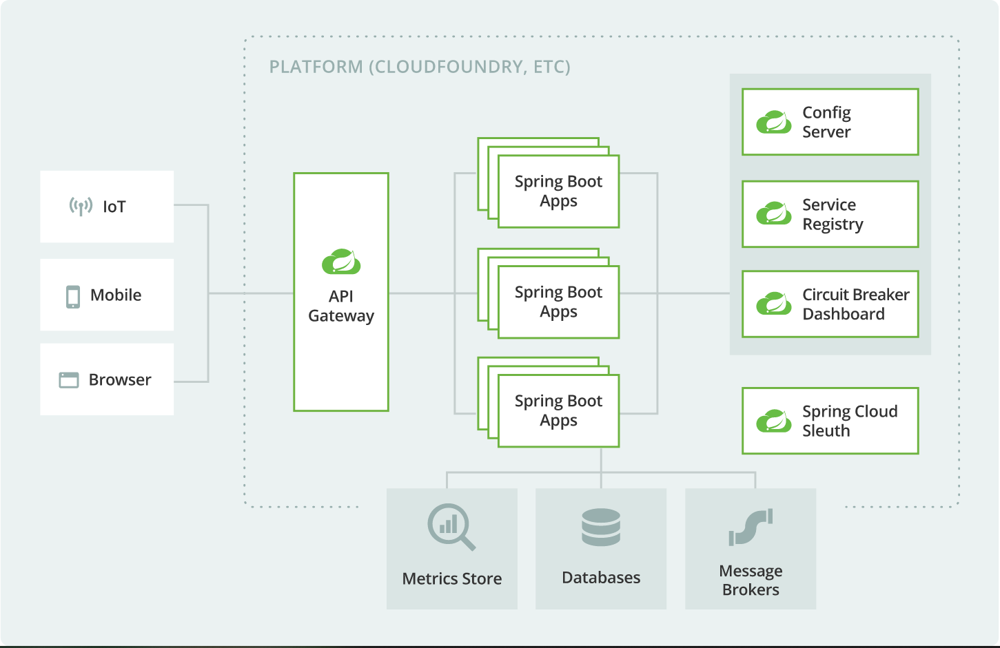

# spring-cloud-demo

* https://github.com/netbuffer/spring-cloud-demo  
* https://gitee.com/netbuffer/spring-cloud-demo

### help

* [Greenwich.SR2](https://cloud.spring.io/spring-cloud-static/Greenwich.SR2/single/spring-cloud.html)
* [spring-cloud-netflix](https://cloud.spring.io/spring-cloud-netflix/reference/html/)
* [spring-cloud-ribbon](https://cloud.spring.io/spring-cloud-netflix/reference/html/#spring-cloud-ribbon) / [ribbon](https://github.com/Netflix/ribbon/wiki/Getting-Started)
* [spring-cloud-feign](https://cloud.spring.io/spring-cloud-openfeign/reference/html/#spring-cloud-feign)
* [https://github.com/Netflix/Hystrix/wiki](https://github.com/Netflix/Hystrix/wiki)
* [https://github.com/Netflix/zuul/wiki/](https://github.com/Netflix/zuul/wiki/)
* [spring-cloud-config](https://cloud.spring.io/spring-cloud-static/spring-cloud-config/2.1.3.RELEASE/single/spring-cloud-config.html)
* [spring-cloud-sleuth](https://cloud.spring.io/spring-cloud-static/spring-cloud-sleuth/2.1.2.RELEASE/single/spring-cloud-sleuth.html)

### reference
* java -Dskywalking.agent.service_name=scd::scd-eureka -Dskywalking.agent.instance_name=scd -Dskywalking.collector.backend_service=localhost:11800 -javaagent:your_absolute_path/skywalking-agent.jar -jar eureka-demo/target/eureka-demo.jar --spring.profiles.active=test
* java -Dskywalking.agent.service_name=scd::scd-zuul -Dskywalking.agent.instance_name=scd -Dskywalking.collector.backend_service=localhost:11800 -javaagent:your_absolute_path/skywalking-agent.jar -jar zuul-demo/target/zuul-demo.jar --spring.profiles.active=test
* java -Dskywalking.agent.service_name=scd::scd-usp -Dskywalking.agent.instance_name=scd -Dskywalking.collector.backend_service=localhost:11800 -javaagent:your_absolute_path/skywalking-agent.jar -jar user-service-provider/target/user-service-provider.jar --spring.profiles.active=test